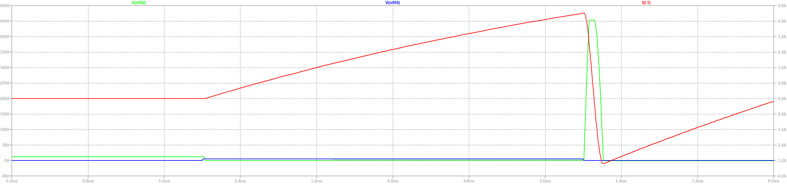
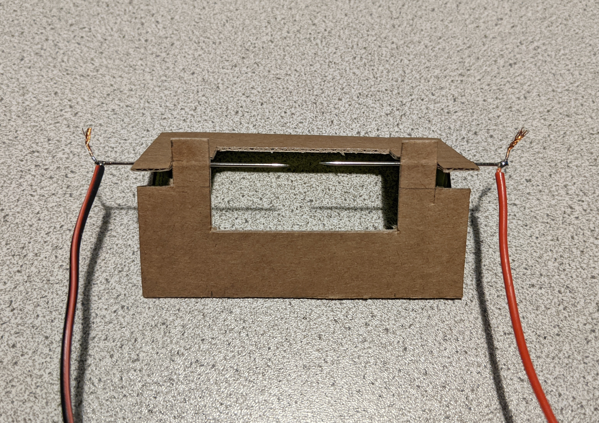

# spark_calibrator
## Be carefull! Igntion coils can step up the voltage up to 1:100, wich means on the secondary side there can be voltages up to 40kV!
Over serial communication controlled spark generator using an arduino as digital controller and a car ignition coil as step up transformer.  
A 3D modell of the full assembly and spark gab, as well as all 3d printed parts will be added soon.

## Schematics (without Arduino)
A MOSFET is used to switch the coil. To avoid voltage spikes on the direct switching action, C2 is used to buffer the spike.  
To limit the overall voltage spike on the primary side, the TVS-diode D2 is used to limit to 440V.  

Switching and digital side are isolated via an optocoupler

## Simulation

In blue one can see the input pwm signal, triggering the charge of the coil, seen in the current over the coil in red. After voltage to the coil is cut of, the magnetic field collapses with a huge voltage spike in green. The spike is limited by the TVS-diode to 440V, this can be seen as clipping on the green signal.

## Board layout
The board can be screwed directly to the coil terminals, to keep the leads as short as possible, depending on your could the board has to be adjusted.  
The Arduino is mounted via a 3D printed part on the back of the coil and connects to the board via 3 wires.  

| main_board | ignition coil |
|:-----------------------------:|:----------------------------------:|
|  |  |

## Spark gap

In order to generate consistent sparks, the spark gap should consist of two pointy metal parts. For spark calibration, audio reflections should be avoided, therefore I build a small spark gap device, using sewing needles and cardboard. The width can be varied, to test the effect of the spark length on the generated impulse.

