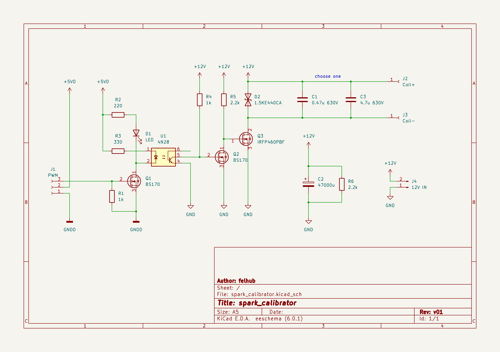

# spark_calibrator

Over serial communication controlled spark generator using an arduino as digital controller and a car ignition coil as step up transformer.  
A 3D modell of the full assembly and spark gab, as well as all 3d printed parts will be added soon.

## Schematics (without Arduino)
A MOSFET is used to switch the coil. To avoid voltage spikes on the direct switching action, C2 is used to buffer the spike.  
To limit the overall voltage spike on the primary side, the TVS-diode D2 is used to limit to 440V.  

Switching and digital side are isolated via an optocoupler

## Board layout
The board can be screwed directly to the coil terminals, to keep the leads as short as possible, depending on your could the board has to be adjusted.  
The Arduino is mounted via a 3D printed part on the back of the coil and connects to the board via 3 wires.  

| main_board | ignition coil |
|:-----------------------------:|:----------------------------------:|
|  |  |
